# 📦 Containerized Web Application with PostgreSQL (Assignment 1)

## 👤 Name: Loveneet Rulhan
## Sap -id :500123392
## batch : 3


## 📚 Subject: Containerization and DevOps

## 📅 Semester: 6

---

# 🎯 Objective

To design, containerize, and deploy a web application using:

* PostgreSQL (Database)
* FastAPI (Backend)
* Docker & Docker Compose
* Macvlan networking with static IP

---

# 🏗️ Project Architecture

Client → Backend (FastAPI) → PostgreSQL Database

* Backend communicates with DB using environment variables
* Macvlan network used for static IP
* Bridge network used for host access

---

# 📁 Project Structure

```
assignment-1/
│
├── backend/
│   ├── app.py
│   ├── Dockerfile
│   └── requirements.txt
│
├── db/
│   ├── Dockerfile
│   └── init.sql
│
└── docker-compose.yml
```

📸 Screenshot:
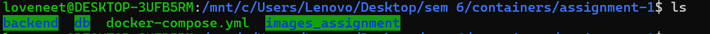

---

# ⚙️ Backend Implementation

* FastAPI used to build REST APIs
* Endpoints:

  * `/` → Health check
  * `/insert` → Insert data
  * `/data` → Fetch data

📸
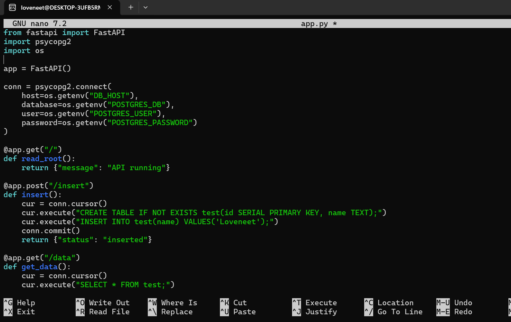

📸
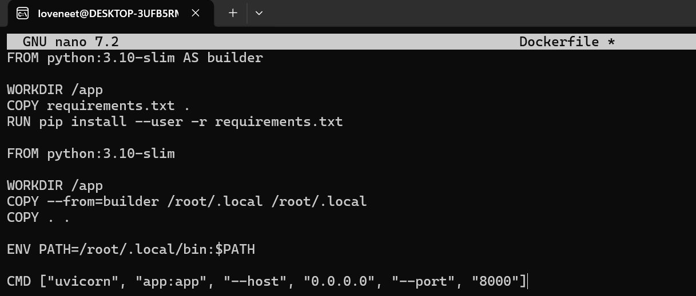

📸
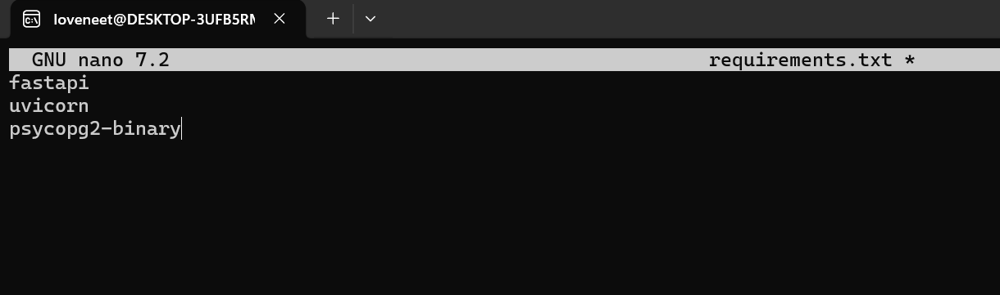

---

# 🗄️ Database Setup

* PostgreSQL container with custom Dockerfile
* Initialization script creates table

📸
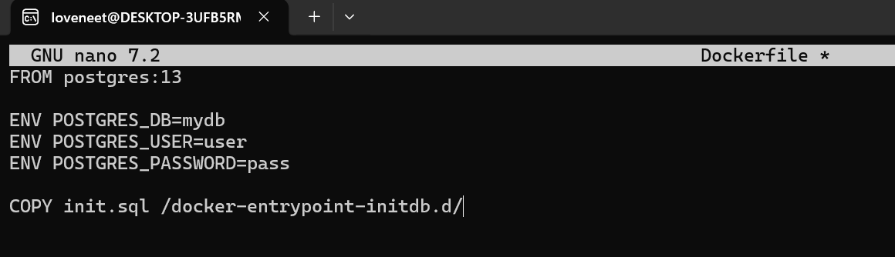

📸
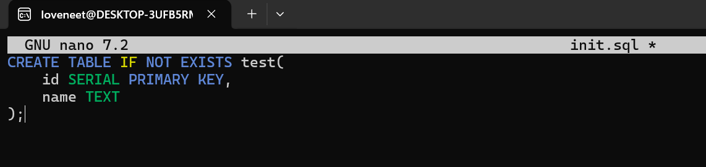

---

# 🔗 Docker Compose Configuration

* Two services: backend & db
* Static IP assigned using macvlan
* Volume used for persistence
* Bridge network added for host access

📸
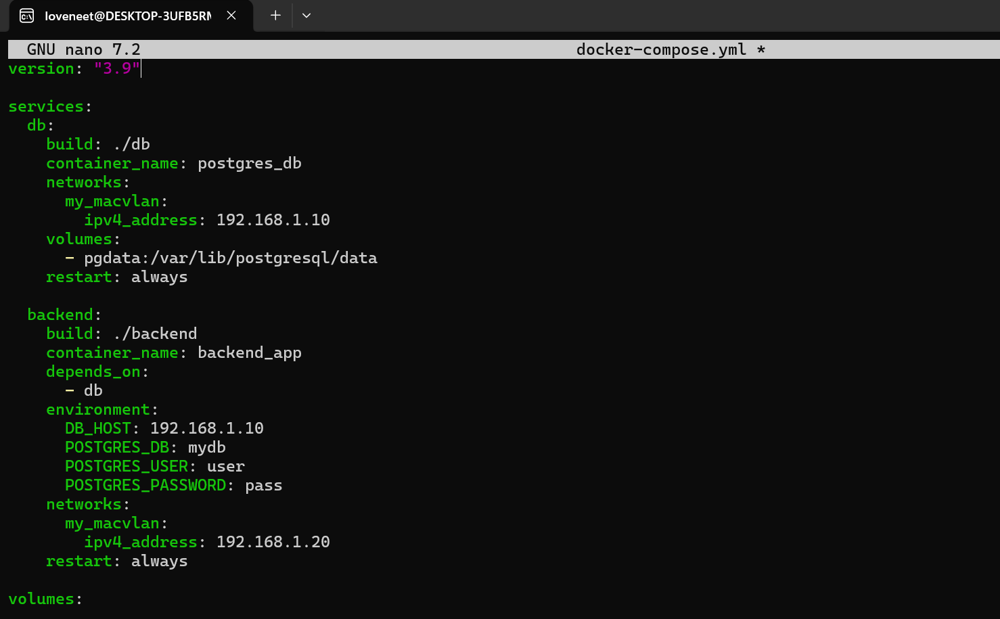

---

# 🌐 Network Configuration

* Macvlan network created with subnet
* Static IP assigned:

  * DB → 192.168.1.10
  * Backend → 192.168.1.20

📸
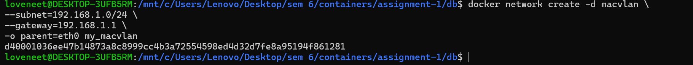

---

# 🚀 Build & Run

```bash
docker compose up --build -d
```

📸
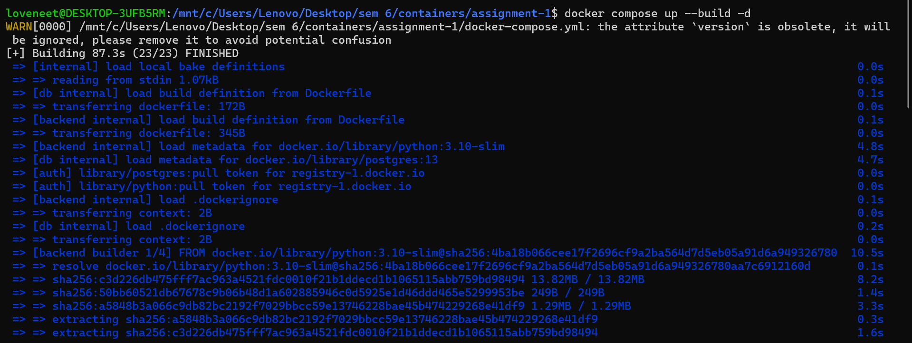

---

# 🐳 Running Containers

```bash
docker ps
```

📸
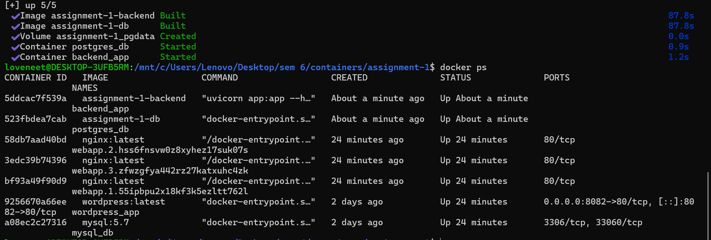

---

# 🔍 Network Inspection

```bash
docker network inspect my_macvlan
```

📸
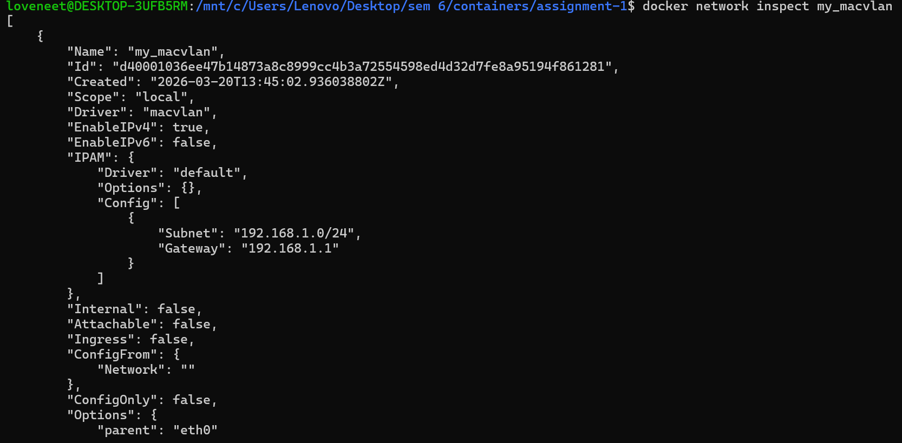

---

# 🌐 API Testing

## Root API

```bash
curl http://localhost:8000/
```

📸


---

## Insert Data

```bash
curl -X POST http://localhost:8000/insert
```

📸
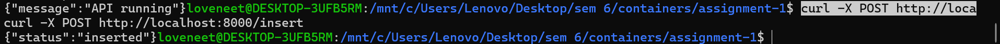

---

## Fetch Data

```bash
curl http://localhost:8000/data
```

📸


---

# 💾 Volume Persistence

## Before Restart

📸


---

## Stop Containers

```bash
docker compose down
```

📸
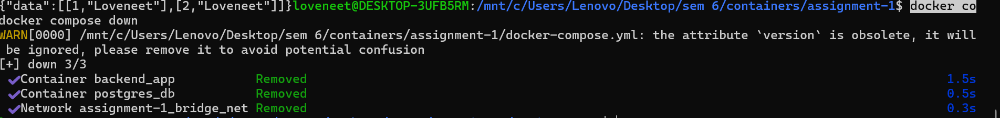

---

## Restart Containers

```bash
docker compose up -d
```

📸
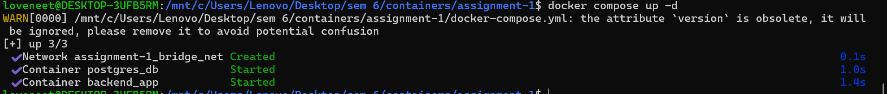

---

## After Restart

📸
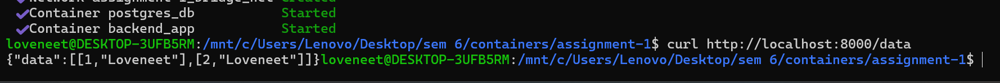

---

# 📊 Logs & Inspection

```bash
docker logs backend_app
```

📸
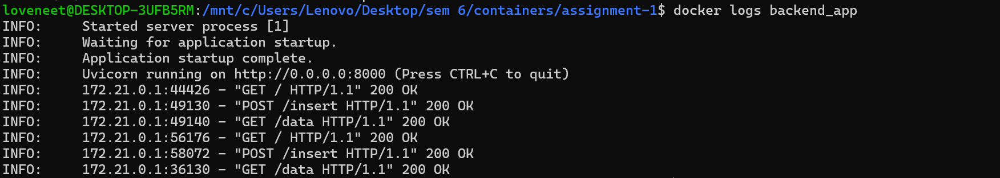

---

```bash
docker inspect backend_app
```

📸
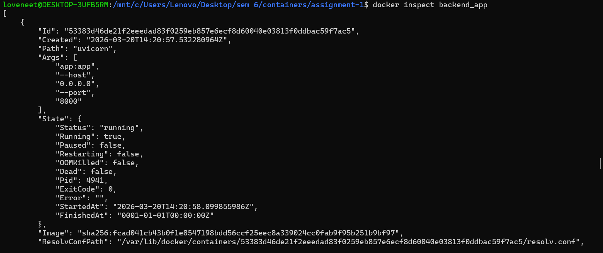

---

```bash
docker volume ls
```

📸
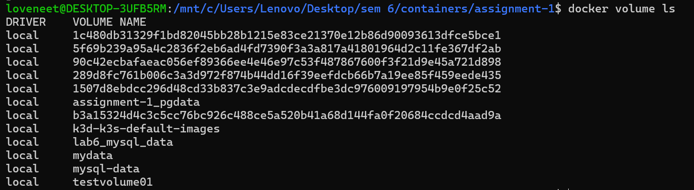


---

# ⚠️ Macvlan Limitation

```bash
curl http://192.168.1.20:8000   ❌
curl http://localhost:8000      ✅
```

📸
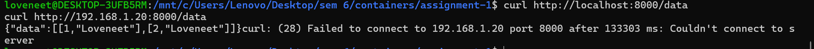

---

# 🧠 Explanation

Macvlan network isolates containers from the host system.
Therefore:

* Direct access using container IP fails
* Port mapping with bridge network allows access

---

# 📌 Key Features Implemented

✔ Docker multi-stage builds
✔ PostgreSQL container with custom config
✔ Static IP assignment (macvlan)
✔ Docker Compose orchestration
✔ Volume persistence
✔ API endpoints
✔ Network isolation demonstration

---

# 🏁 Conclusion

The project successfully demonstrates containerization of a web application using Docker.
It also highlights networking concepts such as macvlan isolation and bridge network communication.

---

# 🚀 END
